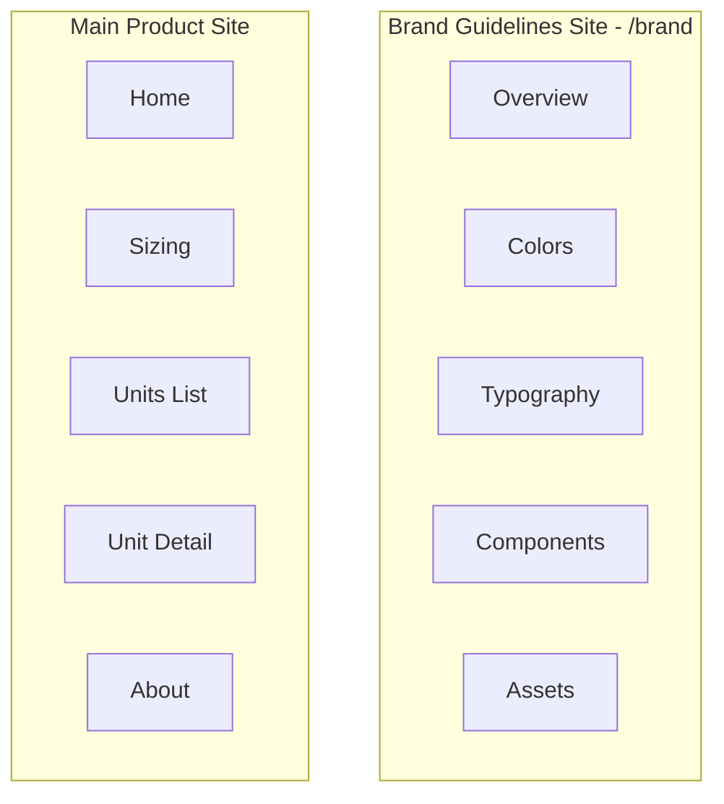

# PRD: Brand Pages Structure

**Purpose:** This document defines the must-have elements per page for the UrbanStash brand implementation. It covers **(A) Brand Guidelines Pages** (design system documentation) and **(B) Main Product Pages** (the consumer-facing site).

**Status:** Draft  
**Last updated:** [Date]

---

## Document Structure

---

## Part A: Brand Guidelines Pages

Routes under `/brand/`. These pages document the design system for designers and developers. They should reflect the rebranded look and feel.

---

### A.1 Overview — `/brand`

**Purpose:** Entry point to the brand guidelines. Provides high-level brand story and quick reference.

| Element | Required | Description |
|---------|----------|-------------|
| Brand story | Yes | 2–4 sentence narrative about UrbanStash’s purpose and positioning |
| Logo usage | Yes | Primary logo display with clear space rules and minimum size |
| Quick reference | Yes | Links or inline previews to Colors, Typography, Components, Assets |
| Navigation | Yes | Header/nav to other brand pages |

---

### A.2 Colors — `/brand/colors`

**Purpose:** Full color palette documentation for implementation.

| Element | Required | Description |
|---------|----------|-------------|
| Primary swatches | Yes | All primary colors with hex and HSL values |
| Secondary swatches | Yes | Secondary color swatches with values |
| Neutral swatches | Yes | Background and text neutrals |
| Semantic swatches | Yes | Success, error, info colors |
| Usage notes | Yes | When to use each color (e.g., "Primary for CTAs only") |
| Contrast ratios | Yes | WCAG contrast ratios for primary text-on-background pairs |
| Dark/Light modes | Yes | If applicable, show both modes |

---

### A.3 Typography — `/brand/typography`

**Purpose:** Typographic scale and usage rules.

| Element | Required | Description |
|---------|----------|-------------|
| Font specimens | Yes | H1–H6, body, caption shown with font name and size |
| Type scale | Yes | Table or list of size/line-height/weight per token |
| Pairing examples | Yes | Headline + body combinations in context |
| Usage rules | Yes | Which font/size for headlines vs body vs UI labels |

---

### A.4 Components — `/brand/components`

**Purpose:** Reusable UI components and usage rules.

| Element | Required | Description |
|---------|----------|-------------|
| Button variants | Yes | Primary, secondary, ghost with all states (default, hover, active, disabled) |
| Cards | Yes | Default card style with border/shadow, padding, hover state |
| Form elements | Yes | Input, select, checkbox, radio with states |
| Usage rules | Yes | When to use each variant (e.g., "Primary for main CTA only") |

---

### A.5 Assets — `/brand/assets`

**Purpose:** Logo and icon assets with download links.

| Element | Required | Description |
|---------|----------|-------------|
| Logo variants | Yes | Full logo, icon only, wordmark in light and dark |
| Icon set | Yes | Key icons used across the site (or link to icon library) |
| Download links | Yes | Exportable assets (SVG, PNG) or instructions for export |

---

## Part B: Main Product Pages

Routes for the main consumer-facing site. Each page has required elements that must be present post-rebrand.

---

### B.1 Home — `/`

**Purpose:** Land visitors, communicate value proposition, drive to Find Storage.

*Status: ✓ = present, ⚠ Missing = gap vs competitors*

| Element | Required | Status | Description |
|---------|----------|--------|-------------|
| Hero section | Yes | ✓ | Full-width hero with headline, subheadline, and primary CTA ("Find storage") |
| Feature grid | Yes | ✓ | Exactly 4 feature cards (e.g., "We've got your back", "IT'S ALL ABOUT CONVENIENCE", "We celebrate our community", "LIKE GRABBING A COFFEE AT YOUR LOCAL SPOT") |
| Internal link to Sizing | Yes | ✓ | Link to /sizing (e.g. in hero CTA area or nav) — 4/5 competitors have |
| How it works | Yes | ✓ | Exactly 3 steps (e.g., Find & book, Get your code, Start stashing) with optional CTA |
| Testimonials | Yes | ✓ | At least 4 testimonial cards with quote, author name, and time |
| FAQ section | Yes | ✓ | Collapsible or list of FAQ questions |
| Primary CTA repeated | Yes | ✓ | "Find storage" or equivalent CTA repeated at least once after hero |
| Address / zip search in hero | No | ⚠ Missing | Location-first discovery — 4/5 competitors have; high priority for conversion |
| Promo banner | No | ⚠ Missing | e.g. "$1 first month", "% off" — Public Storage, Stuf use; consider for acquisition |
| Trust / awards badges | No | ⚠ Missing | "Trusted by…", awards, city count — Public Storage, Stuf use; builds credibility |
| Media mentions / press | No | ⚠ Missing | Logos or quotes from press — 1/5 have; optional trust builder |
| Header | Yes | ✓ | Logo, nav (Home, Sizing, Locations, About), Find Storage button, Login |
| Footer | Yes | ✓ | Logo, social links, address (32 Mercer St), About, T&C, Privacy, FAQ |

---

### B.2 Sizing — `/sizing`

**Purpose:** Help users understand unit sizes and drive to Find Storage.

*Status: ✓ = present, ⚠ Missing = gap vs competitors*

| Element | Required | Status | Description |
|---------|----------|--------|-------------|
| Intro copy | Yes | ✓ | Headline ("About our stash sizes"), supporting paragraph, primary CTA |
| Storage Unit Guide grid | Yes | ✓ | Grid of size cards showing Small/Medium/Large with dimensions and "perfect for" labels (e.g., 4×3×4 for seasonal essentials) |
| Compare sizes table | Yes | ✓ | Table with columns: Size, Square feet, Perfect for |
| "Perfect for" / use-case labels | Yes | ✓ | Per-unit use cases (seasonal essentials, apartment extras, etc.) — 5/5 competitors |
| Why stash with us | Yes | ✓ | Exactly 3 items (e.g., Right Around the Corner, Your Space Your Rules, Protected & Monitored) |
| FAQ section | Yes | ✓ | Sizing-related FAQ items |
| Size guide with visuals / animation | No | ✓ | Table format — SecureSpace/Public use interactive; consider upgrade |
| Header | Yes | ✓ | Same as Home |
| Footer | Yes | ✓ | Same as Home |

---

### B.3 Units List — `/units`

**Purpose:** Browse storage locations in NYC and navigate to facility details.

*Status: ✓ = present, ⚠ Missing = gap vs competitors*

| Element | Required | Status | Description |
|---------|----------|--------|-------------|
| Page title | Yes | ✓ | "Available Units in NYC" or equivalent |
| Location cards | Yes | ✓ | For each location: name, address, featured review snippet, author, unit size badges (Small/Medium/Large from $X/mo), "Check Availability" CTA |
| Map area | Yes | ✓ | Map or placeholder for map (e.g., "Map placeholder" or embedded map) |
| Filters (Price, Size, Neighborhood) | No | ⚠ Missing | 2/5 competitors have; UrbanStash has none currently — planned |
| Neighborhood / city browse | No | ⚠ Missing | 4/5 competitors have (by area, city, or region) |
| Newly Opened / Upcoming locations | No | ⚠ Missing | SecureSpace, Public Storage use; drives urgency |
| Location count badge | No | ⚠ Missing | e.g. "7 cities", "87 locations" — 3/5 competitors; social proof |
| Header | Yes | ✓ | Same as Home (Find Storage may be hidden on this page) |
| Footer | Yes | ✓ | Same as Home |

---

### B.4 Unit Detail — `/units/:slug`

**Purpose:** Facility details, availability, and booking. Example: `/units/24-avenue-b`.

*Status: ✓ = present, ⚠ Missing = gap vs competitors*

| Element | Required | Status | Description |
|---------|----------|--------|-------------|
| Breadcrumb | Yes | ✓ | Home › Units › [Facility Name] |
| Gallery | Yes | ✓ | Image gallery or placeholder for facility photos |
| Facility name | Yes | ✓ | H1 with location name |
| Address | Yes | ✓ | Full street address |
| Reviews count | Yes | ✓ | e.g., "28 Reviews" with optional star rating |
| Quick links | Yes | ✓ | "Sizing guide", "View on Map" |
| Storage Facility Features | Yes | ✓ | List of features (e.g., Security Cameras, Cancel anytime, Contactless Move-Ins, Smart Lock, Keypad Entry, Instant approval) |
| Access Hours | Yes | ✓ | e.g., "7:00 AM–9:30 PM (Every day)" |
| Availability | Yes | ✓ | Unit cards: size, sq ft, price/month, description, "Show All Available Units" or equivalent CTA |
| About this space | Yes | ✓ | Paragraph describing the neighborhood/location |
| How it works | Yes | ✓ | 4 steps: Reserve Online, Get Access, Move-In, Manage Account |
| Reviews | Yes | ✓ | At least 4 review cards (quote, author, time) |
| Sticky booking card | Yes | ✓ | Right column, sticky: size selector (Small/Medium/Large), unit dropdown, Move-in date, Estimated stay, "Book Now" button, "You won't be charged yet" disclaimer |
| Header | Yes | ✓ | Same as Home |
| Footer | Yes | ✓ | Same as Home |

---

### B.5 About — `/about`

**Purpose:** Communicate brand story, mission, and differentiators. Build trust and drive to Find Storage.

*Status: ✓ = present, ⚠ Missing = gap vs competitors*

| Element | Required | Status | Description |
|---------|----------|--------|-------------|
| Hero section | Yes | ✓ | Headline ("Started in the neighborhood"), subheadline about local storage, primary CTA ("Find storage") |
| Making storage personal | Yes | ✓ | Section: Traditional storage vs UrbanStash — we design each location to reflect its neighborhood |
| Built by locals, for locals | Yes | ✓ | Section: Team lives in neighborhoods served, local knowledge shapes everything |
| Storage that works for city life | Yes | ✓ | Section: Storage as easy as an extra closet, convenient/secure/straightforward |
| Where we're headed | Yes | ✓ | Section: Reimagining storage — accessible, local, designed for city living |
| Image placeholders | Yes | ✓ | Space for brand imagery (neighborhood photos, team, facilities) |
| FAQ section | Yes | ✓ | Same FAQ items as other pages |
| Primary CTA | Yes | ✓ | "Find storage" CTA |
| Header | Yes | ✓ | Same as Home |
| Footer | Yes | ✓ | Same as Home |

---

### B.6 Global / Site-Wide

**Purpose:** Elements that appear across the site or in shared areas (header, footer, modals).

*Status: ✓ = present, ⚠ Missing = gap vs competitors*

| Element | Required | Status | Description |
|---------|----------|--------|-------------|
| Newsletter / email signup | No | ⚠ Missing | 3/5 competitors have; "Stay informed about new locations" etc. |
| Mobile app CTA | No | ⚠ Missing | Public Storage uses; "Manage your space with your phone" — consider when app exists |

---

## Shared Elements (All Main Product Pages)

These elements must appear consistently across Home, Sizing, Units List, Unit Detail, and About:

| Element | Notes |
|---------|-------|
| Header | Logo links to Home. Nav: Home, Sizing, Locations, About. Find Storage CTA (except on Units List and Unit Detail where context is already "find storage"). Login button. |
| Footer | Logo, social icons (Facebook, TikTok, Instagram, LinkedIn), address, About, T&C, Privacy Policy, FAQ links. |
| Primary CTA | Must use brand primary color and comply with button component spec. |
| Typography | All text must use defined type scale. |
| Colors | All surfaces, text, and accents must use defined color palette. |

---

## Appendix: Us vs Competitors — Element Comparison

Comparison of key site elements across UrbanStash and competitors, organized by section. ✓ = present, — = not present or minimal.

### Home

| Element | UrbanStash | Local Locker | SecureSpace | Public Storage | Stuf Storage |
|---------|:----------:|:------------:|:-----------:|:--------------:|:-----------:|
| Headline + subheadline | ✓ | ✓ | ✓ | ✓ | ✓ |
| Primary CTA (Find/Get storage) | ✓ | ✓ | ✓ | ✓ | ✓ |
| Address / zip search in hero | — | ✓ | ✓ | ✓ | ✓ |
| Promo banner ($1 first month, % off) | — | — | — | ✓ | ✓ (55% off 3 months) |
| Feature grid (3–4 items) | ✓ (4) | ✓ (3) | ✓ (4 types) | ✓ | ✓ (4+4) |
| "Why store with us" / value props section | ✓ | ✓ | ✓ | ✓ | ✓ |
| "Extension of home/closet" messaging | ✓ | ✓ | — | ✓ | ✓ |
| How it works (3 steps) | ✓ | ✓ | ✓ | ✓ | — |
| Internal link to Sizing page | ✓ | — | ✓ | ✓ | ✓ |
| Testimonials | ✓ | ✓ | — | ✓ | — |
| Star ratings on testimonials | ✓ | ✓ | — | — | ✓ |
| Trust / awards badges | — | — | — | ✓ | ✓ |
| Media mentions / press | — | — | — | ✓ | — |
| FAQ section | ✓ | ✓ | ✓ | ✓ | — |

### Sizing / Size Guide

| Element | UrbanStash | Local Locker | SecureSpace | Public Storage | Stuf Storage |
|---------|:----------:|:------------:|:-----------:|:--------------:|:-----------:|
| Dedicated sizing page | ✓ | — | ✓ | ✓ | ✓ (inline) |
| Size guide grid / cards | ✓ | — | ✓ | ✓ | ✓ |
| Compare sizes table | ✓ | — | ✓ | ✓ | ✓ |
| "Perfect for" / use-case labels | ✓ | — | ✓ | ✓ | ✓ |
| Size guide with visuals / animation | ✓ (table) | — | ✓ (interactive) | ✓ | ✓ |

### Units List

| Element | UrbanStash | Local Locker | SecureSpace | Public Storage | Stuf Storage |
|---------|:----------:|:------------:|:-----------:|:--------------:|:-----------:|
| Location cards with reviews | ✓ | ✓ | ✓ | ✓ | ✓ |
| Map / map placeholder | ✓ | — | ✓ | ✓ | ✓ |
| Filters (Price, Size, Neighborhood) | — | — | ✓ | ✓ | — |
| Neighborhood / city browse | — | ✓ | ✓ (by region) | ✓ (by city) | ✓ (7 cities) |
| Newly Opened / Upcoming locations | — | — | ✓ | ✓ | — |
| Location count badge | — | — | ✓ | ✓ | ✓ ("7 cities") |

### Unit Detail

| Element | UrbanStash | Local Locker | SecureSpace | Public Storage | Stuf Storage |
|---------|:----------:|:------------:|:-----------:|:--------------:|:-----------:|
| Breadcrumb navigation | ✓ | — | ✓ | ✓ | — |
| Gallery | ✓ | ✓ | ✓ | ✓ | ✓ |
| Filters (Price, Size, Neighborhood) | — | — | ✓ | ✓ | — |
| Facility name + address | ✓ | ✓ | ✓ | ✓ | ✓ |
| Features list | ✓ | ✓ | ✓ | ✓ | ✓ |
| Access Hours | ✓ | ✓ | ✓ | ✓ | ✓ |
| Unit cards (size, price, CTA) | ✓ | ✓ | ✓ | ✓ | ✓ |
| About this space | ✓ | — | ✓ | ✓ | ✓ |
| How it works (4 steps) | ✓ | — | ✓ | ✓ | — |
| Reviews | ✓ | ✓ | ✓ | ✓ | ✓ |
| Sticky booking card | ✓ | — | ✓ | ✓ | — |
| Size selector (S/M/L) | ✓ | — | ✓ | ✓ | ✓ |
| Move-in date picker | ✓ | — | ✓ | ✓ | — |

### About

| Element | UrbanStash | Local Locker | SecureSpace | Public Storage | Stuf Storage |
|---------|:----------:|:------------:|:-----------:|:--------------:|:-----------:|
| Dedicated About page | ✓ | — | ✓ | ✓ | — |
| Brand story / mission | ✓ | — | ✓ | ✓ | — |

### Global / Additional

| Element | UrbanStash | Local Locker | SecureSpace | Public Storage | Stuf Storage |
|---------|:----------:|:------------:|:-----------:|:--------------:|:-----------:|
| Mobile app CTA | — | — | — | ✓ | — |
| Newsletter / email signup | — | ✓ | ✓ | ✓ | — |

---

## Appendix: Competitor Insights (Detail)

Elements observed from competitors ([Local Locker](https://localocker.com/), [SecureSpace](https://securespace.com/), [Public Storage](https://www.publicstorage.com/), [Stuf Storage](https://www.stufstorage.com/)) that may inform future enhancements:

| Competitor | Element | Description |
|------------|---------|-------------|
| **Local Locker** | Address search in hero | "Enter your address" + Get Pricing CTA directly in hero; location-first discovery |
| **Local Locker** | "We offer" bullet list | Short value props: Contactless move-ins, Month-to-month, No hidden fees |
| **Local Locker** | Neighborhood grid | "Find Storage by NYC Neighborhood" — Brooklyn (Williamsburg, Greenpoint, Park Slope...), Manhattan (Upper East Side, Harlem, East Village...) |
| **Local Locker** | Newsletter signup | "Stay informed about new locations" — email capture |
| **SecureSpace** | Storage type cards | Self storage, Business storage, Climate-controlled, Vehicle storage — distinct offering tiles |
| **SecureSpace** | Newly Opened / Upcoming | "Newly Opened Locations" + "Upcoming Locations" sections with Pre-Reserve CTA |
| **SecureSpace** | Size guide with visuals | Interactive/animated size guide (5×5, 5×10, etc.) with "Replay animation" |
| **SecureSpace** | Location count | "87 Locations and Counting" — social proof |
| **Public Storage** | Promo banner | "$1 First Month", "Save up to 40% OFF" — prominent offer in hero |
| **Public Storage** | Mobile app CTA | "Manage your space with your phone" — Open Gates, Pay Bills, Manage Account; app store badges |
| **Public Storage** | Trust badges | "Trusted nationwide by customers and team members" — awards from Comparably |
| **Public Storage** | Nearby locations list | "Just think of us as an extension of your home" + nearby facility cards with distance |
| **Public Storage** | "Extension of home" | Consistent "extension of your home/closet" messaging across competitors |
| **Stuf Storage** | Promo banner | "55% off Your First 3 Months | Use Code SPRING55" — seasonal promo with code |
| **Stuf Storage** | Trust badge | "Trusted by thousands of renters across 7 cities" — city count as social proof |
| **Stuf Storage** | City-first hero | "Self-Storage In Your Neighborhood" — city links (Atlanta, Boston, LA, NYC, SF, Seattle, DC) |
| **Stuf Storage** | "Why store with us" | 4 value props: No hidden fees, Storage near home/work, Month to Month, Complimentary padlock |
| **Stuf Storage** | "Not your average storage" | 4 feature cards: Neighborhood storage, Secure spaces, Digital key, Personalized service |
| **Stuf Storage** | Size guide (S/M/L) | Small (3×3), Medium (3×3–6×7), Large (6×7+) with use-case descriptions |
| **Stuf Storage** | Compare sizes table | [stufstorage.com/sizing](https://www.stufstorage.com/sizing) includes a compare sizes table |

**Consider for UrbanStash:** Address/location search in hero, neighborhood browse, promo banner placement, mobile app CTA, newsletter signup, "Newly Opened" locations section.

---

## Implementation Notes

1. **Order of work:** Implement shared Header/Footer first, then Home, then Sizing, Units List, Unit Detail. Brand Guidelines pages can be built in parallel or after main pages.
2. **Responsiveness:** All elements must be responsive. Specify breakpoints if brand defines them.
3. **Accessibility:** All elements must meet WCAG 2.1 AA. Contrast and focus states are mandatory.
4. **404:** A "Location not found" state exists for invalid `/units/:slug`. Must-have: headline, "Back to locations" link.

---

## Appendix: Current Route Map

| Route | Page |
|-------|------|
| `/` | Home |
| `/sizing` | Sizing |
| `/units` | Units List |
| `/units/:slug` | Unit Detail (e.g. `/units/24-avenue-b`) |
| `/about` | About |
| `/brand` | Brand Overview (to be built) |
| `/brand/colors` | Colors (to be built) |
| `/brand/typography` | Typography (to be built) |
| `/brand/components` | Components (to be built) |
| `/brand/assets` | Assets (to be built) |
